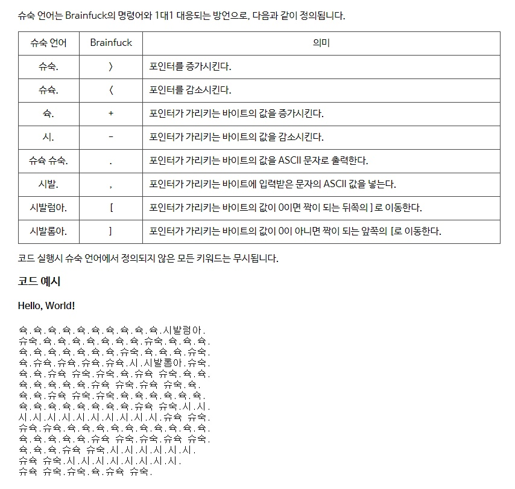
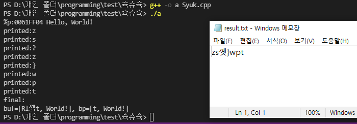

## 슉슈슉
시.시발롬아  

  

## 주의 사항
[와 ]는 현재 goto만 있고 종결 조건이 없으므로, skip으로 처리하였습니다.  
I dealt with skip the brackets([ and ]) because there is no conditions of them.

## 결과 화면
  
'Hello World!'의 문자열을 버퍼로 정하면, 위와 같은 결과를 얻을 수 있습니다.  
여러 가지 시도해보십시오! 슉.슈슉.시.시.시발롬아.
